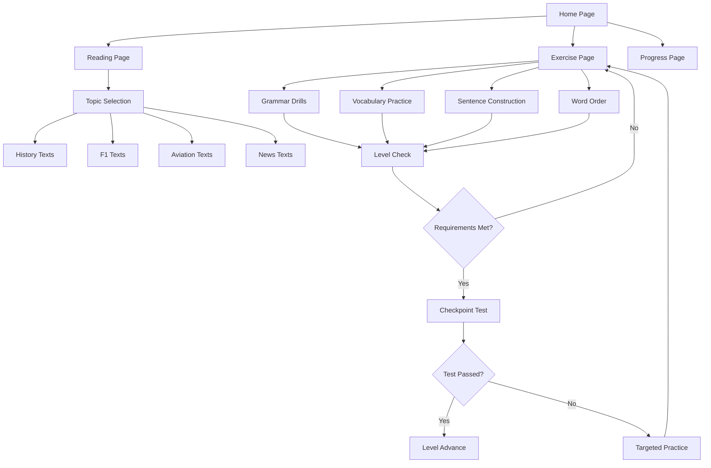

## 1. Product Overview
A text-first German learning platform (A0-B1) for English and Chinese speakers. The system combines structured progression exercises with open exploration reading materials, using deterministic content generation without AI/LLM calls.
It integrates with GPS-Homepage via SSO and shares the database using `opendeutsch_*` namespace to avoid conflicts.

Target users: Beginner German learners seeking structured progression with topic-based exploration in history, Formula 1, aviation, and current news.

## 2. Core Features

### 2.1 User Roles
| Role | Registration Method | Core Permissions |
|------|---------------------|------------------|
| Learner | Email registration | Complete exercises, read texts, track progress |
| Guest | No registration | Browse limited content, no progress tracking |

### 2.2 Feature Module
The German learning platform consists of the following main pages:
1. **Home page**: Level overview, topic interests, recent activity, navigation to exercises and reading.
2. **Exercise page**: Grammar drills, vocabulary practice, sentence construction, word-order reconstruction, translation exercises.
3. **Reading page**: Topic-based texts (history, F1, aviation, news), comprehension questions, vocabulary inference.
4. **Progress page**: Official level status, skill metrics, lesson history, achievement tracking.
5. **Settings page**: Language preferences (EN/CN explanations), topic interests management, account settings.

### 2.3 Page Details
| Page Name | Module Name | Feature description |
|-----------|-------------|---------------------|
| Home page | Level dashboard | Display current A0-B1 level, progress bars for grammar/vocabulary mastery, recommended next exercises. |
| Home page | Topic interests | Show selected interest areas (German history, F1, aviation, news), allow modification, display related reading recommendations. |
| Home page | Navigation | Quick access to exercises by type, reading materials by topic, progress tracking. |
| Exercise page | Grammar drills | Template-based sentence generation, multiple choice questions, conjugation practice, case exercises. |
| Exercise page | Vocabulary drills | Word-pool based practice, translation exercises (DE↔EN/CN), contextual usage examples. |
| Exercise page | Sentence construction | Build sentences from word pools, template-based generation with immediate feedback. |
| Exercise page | Word-order reconstruction | Shuffle correct sentences, drag-and-drop reordering, grammatical explanation on completion. |
| Reading page | Text display | Show German text first, toggle EN/CN translations, vocabulary highlighting, length appropriate to level. |
| Reading page | Comprehension questions | Multiple choice for A1, inference questions for A2, analytical questions for B1, immediate feedback. |
| Progress page | Official level | Show A0-B1 status, requirements for next level, mastery percentages for grammar/vocabulary. |
| Progress page | Skill metrics | Track performance in word order, verb conjugation, cases, vocabulary retention with visual charts. |
| Progress page | Lesson history | List completed exercises and readings, timestamps, scores, topics explored. |
| Settings page | Language preferences | Toggle English/Chinese explanations, set German as primary learning language. |
| Settings page | Topic management | Select/deselect interest areas, adjust recommendation weights. |

## 3. Core Process

### Learner Flow
1. User registers and completes onboarding (selects topic interests, sets language preference)
2. System presents recommended exercises based on current level (A0 starts with basic vocabulary)
3. User completes exercises using template-based generation (no AI calls)
4. System tracks mastery and updates skill metrics
5. When requirements met (grammar ≥80%, vocabulary ≥70%), user can take checkpoint test
6. Passing checkpoint advances official level; failure provides targeted practice
7. User can explore reading materials above current level (progress not recorded)
8. System recommends readings based on interest weights and manageable difficulty

### Reading Exploration Flow
1. User browses reading materials by topic or receives recommendations
2. Texts generated using paragraph templates and topic-specific word pools
3. Questions adapted to text length and user level
4. Completion recorded in lesson history but doesn't affect official level
5. System adjusts future recommendations based on reading patterns

## 4. User Interface Design

### 4.1 Design Style
- **Primary colors**: German flag inspired (black #000000, red #FF0000, gold #FFCC00)
- **Secondary colors**: Clean white backgrounds, light gray (#F5F5F5) for cards
- **Button style**: Rounded corners (8px radius), clear hover states, primary actions in red
- **Font**: System fonts with clear hierarchy - 16px base, 24px headers, 14px captions
- **Layout**: Card-based design with clear sections, top navigation bar
- **Icons**: Simple line icons for exercises, topic-specific emoji for reading materials

### 4.2 Page Design Overview
| Page Name | Module Name | UI Elements |
|-----------|-------------|-------------|
| Home page | Level dashboard | Progress bars with percentage labels, level badges (A0-B1), mastery charts using Chart.js |
| Exercise page | Grammar drills | Large German text display, toggle buttons for EN/CN translation, multiple choice cards with 4 options |
| Reading page | Text display | Clean typography with 1.5 line spacing, vocabulary words highlighted in gold, reading time indicator |
| Progress page | Skill metrics | Radar chart showing skill strengths, line graph for progress over time, achievement badges |
| Settings page | Topic interests | Toggle switches for each topic, slider for recommendation sensitivity, language radio buttons |

### 4.3 Responsiveness
Desktop-first design with mobile adaptation. Primary interface optimized for 1024px+ screens, responsive breakpoints at 768px and 480px. Touch interaction optimized for mobile exercise completion.

### 4.4 Content Generation Guidelines
- **Template structure**: Clear grammatical templates with word pool placeholders
- **Sentence variety**: Minimum 1000 unique combinations per template
- **Topic consistency**: Each topic maintains dedicated vocabulary pools
- **Difficulty scaling**: Word complexity and sentence length increase with levels
- **Cultural neutrality**: History topics focus on Berlin Wall, reunification, Weimar Republic