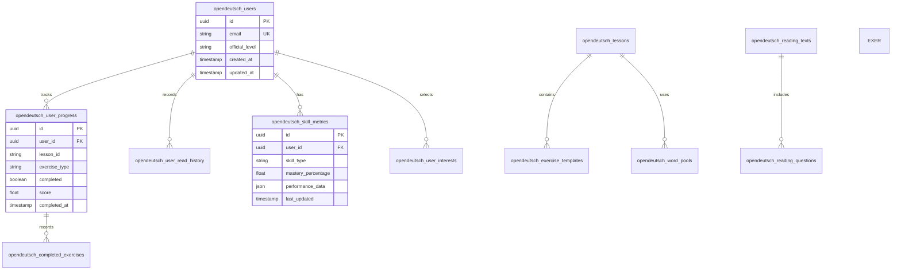

## 1. Architecture Design

```mermaid
graph TD
  A[User Browser] --> B[Next.js Frontend]
  B --> C[Supabase Client]
  C --> D[GPS-Homepage SSO Auth]
  C --> E[Supabase Database (Shared)]
  C --> F[JSON Lesson Content]
  
  subgraph "Frontend Layer"
    B
  end
  
  subgraph "Backend Services (Supabase Shared Instance)"
    D
    E
  end

  subgraph "Content Storage"
    F
  end
```

## 2. Technology Description

* **Frontend**: Next.js\@14 + React\@18 + TypeScript + Tailwind CSS

* **Initialization Tool**: create-next-app

* **Backend**: Supabase (Shared GPS-Homepage Instance)

* **Database Namespacing**: All tables prefixed with `opendeutsch_`

* **Auth**: SSO via GPS-Homepage (Shared Users)

* **Content**: Hybrid (JSON files for static lesson structure, DB for dynamic templates/pools)

* **State Management**: React Context + SWR for data fetching

* **UI Components**: Headless UI + Radix UI primitives

* **Charts**: Chart.js for progress visualization

## 3. Route Definitions

| Route              | Purpose                                                              |
| ------------------ | -------------------------------------------------------------------- |
| /                  | Home page with level dashboard and navigation                        |
| /auth/login        | User authentication page                                             |
| /auth/register     | User registration with topic interest selection                      |
| /exercises         | Exercise type selection (grammar, vocabulary, sentences, word-order) |
| /exercises/\[type] | Specific exercise interface with template generation                 |
| /reading           | Reading material browser by topic                                    |
| /reading/\[id]     | Individual reading text with comprehension questions                 |
| /progress          | User progress dashboard with metrics and history                     |
| /settings          | Language preferences and topic interest management                   |
| /onboarding        | Initial setup for new users                                          |

## 4. API Definitions

### 4.1 Authentication APIs

```
POST /auth/v1/token
```

Request:

```json
{
  "email": "user@example.com",
  "password": "password123"
}
```

### 4.2 Exercise APIs

```
GET /api/exercises?type=grammar&level=A1
```

Response:

```json
{
  "template": "SUBJECT + VERB + OBJECT + LOCATION",
  "wordPools": {
    "subjects": ["ich", "du", "er", "wir"],
    "verbs": ["sehe", "kaufe", "besuche"],
    "objects": ["ein Auto", "einen Zug", "ein Restaurant"],
    "locations": ["in Berlin", "in München"]
  },
  "correctAnswer": "Ich sehe ein Auto in Berlin"
}
```

### 4.3 Progress APIs

```
GET /api/progress/[userId]
```

Response:

```json
{
  "officialLevel": "A1",
  "grammarMastery": 85,
  "vocabularyMastery": 72,
  "skillMetrics": {
    "wordOrder": 78,
    "verbConjugation": 82,
    "cases": 65,
    "vocabulary": 72
  }
}
```

### 4.4 Reading APIs

```
GET /api/reading?topic=history&level=A2&limit=10
```

Response:

```json
{
  "texts": [
    {
      "id": "hist_001",
      "title": "Die Berliner Mauer",
      "content": "Die Berliner Mauer war ein Symbol des Kalten Krieges...",
      "wordCount": 180,
      "questions": [
        {
          "type": "comprehension",
          "question": "Warum wurde die Mauer gebaut?",
          "options": ["Für Sicherheit", "Zur Teilung", "Als Denkmal"],
          "correct": 1
        }
      ]
    }
  ]
}
```

## 5. Data Model

### 5.1 Entity Relationship Diagram



